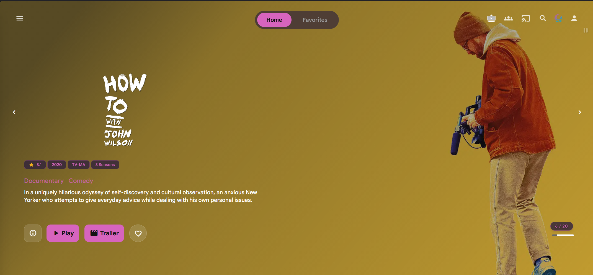
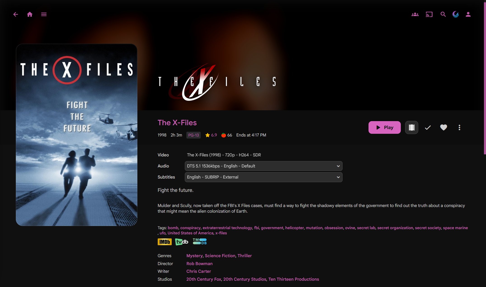

# Abyss

Small tweaks on top of [abyss jellyfin theme](https://github.com/AumGupta/abyss-jellyfin).

| File | Use |
| --- | --- |
| `imports.css` | Paste first in Custom CSS |
| `themes/*.css` | Palette only (`rose.css`, `ocean.css`, etc.) |
| `themes/all-themes.json` | All theme RGB values (picker / tooling) |
| `accent-overlays.css` | Home, MBE hero, detail page accents |
| `themes/rose-full.css` | One file: imports + rose palette + accents + overlays from other folders |

Order:

1. `imports.css`
2. A palette from `themes/`
3. `accent-overlays.css`
4. CSS from other folders

Picker: https://cokezed.github.io/jellyfin-abyss-theme-picker/

## Screenshots

| Home (MBE + theme accents) | Movie detail |
| --- | --- |
|  |  |

## Themes

| File | Label | Group | Accent |
| --- | --- | --- | --- |
| [`themes/stock.css`](themes/stock.css) | Abyss stock | Reference | `rgb(245, 245, 247)` |
| [`themes/rose.css`](themes/rose.css) | Rose orchid (default) | Pink & purple | `rgb(215, 100, 190)` |
| [`themes/lavender.css`](themes/lavender.css) | Lilac | Pink & purple | `rgb(200, 170, 225)` |
| [`themes/midnight.css`](themes/midnight.css) | Royal purple | Pink & purple | `rgb(142, 96, 214)` |
| [`themes/ocean.css`](themes/ocean.css) | Ocean blue | Blue & ice | `rgb(100, 165, 210)` |
| [`themes/frost.css`](themes/frost.css) | Frost | Blue & ice | `rgb(165, 195, 220)` |
| [`themes/sage.css`](themes/sage.css) | Sage green | Green | `rgb(130, 195, 150)` |
| [`themes/jade.css`](themes/jade.css) | Jade | Green | `rgb(95, 170, 150)` |
| [`themes/moss.css`](themes/moss.css) | Moss | Green | `rgb(135, 188, 118)` |
| [`themes/gold.css`](themes/gold.css) | Soft gold | Gold & warm | `rgb(220, 190, 130)` |
| [`themes/honey.css`](themes/honey.css) | Honey | Gold & warm | `rgb(215, 175, 110)` |
| [`themes/copper.css`](themes/copper.css) | Copper | Gold & warm | `rgb(210, 150, 110)` |

Glass tint and secondary live in each theme CSS file (and in `themes/all-themes.json`).
