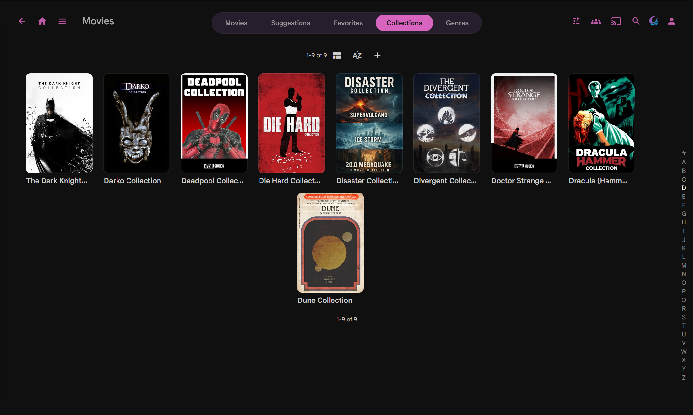
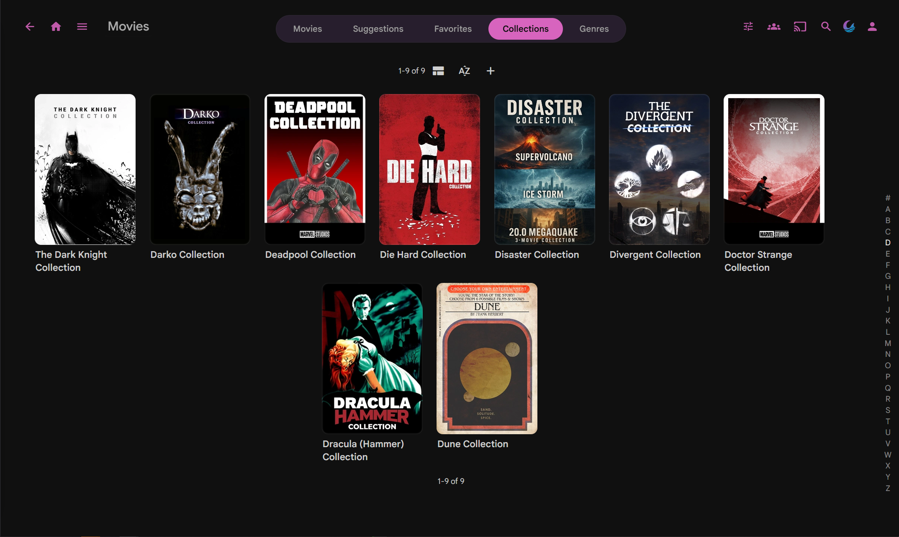
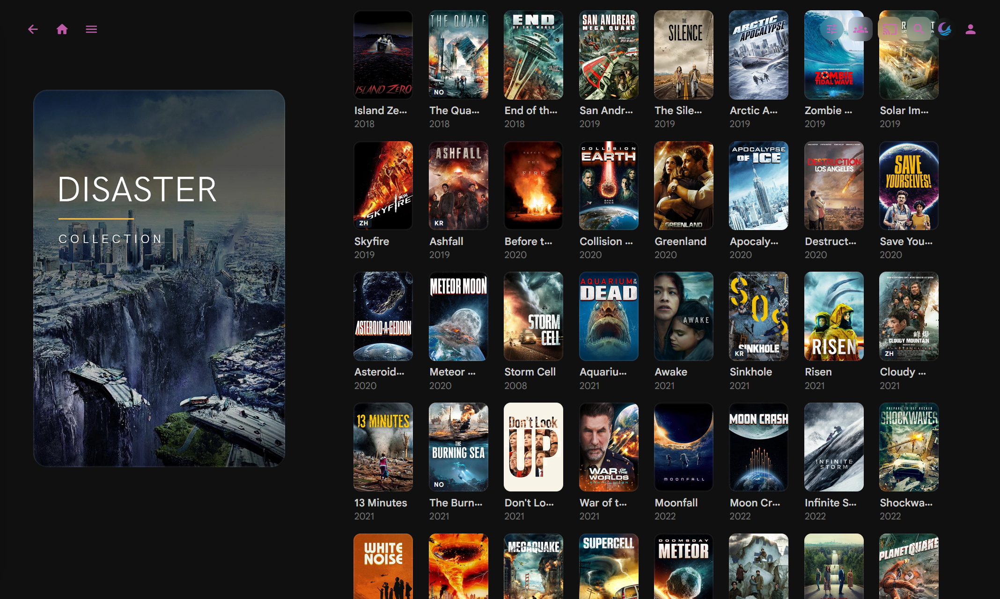
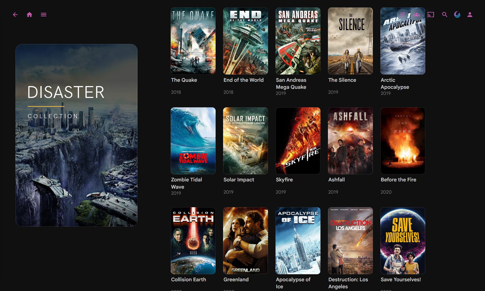

# Collections poster grid

CSS for Collections (BoxSet) layouts. Needs `:has()`.

## What it does

1. **Collections library grid:** about 7 cards per row on wide screens (stock goes 8 to 10), with 2-line titles.
2. **Collection detail page:** child movie and series posters enlarged (~18% width, min ~150px) with 2-line titles. Stock still assumes many columns, so sparse collections look tiny without this.

## Screenshots

### Collections library grid

| Before | After |
| --- | --- |
|  |  |

### Collection detail (sparse)

| Before | After |
| --- | --- |
|  |  |

## Install

1. Append `collections-poster-grid.css` to Custom CSS (Dashboard → Branding, or `branding.xml` `<CustomCss>`).
2. Restart Jellyfin if CSS is served from branding on disk.
3. Hard refresh (Ctrl+Shift+R).

## Notes

- Library grid selectors use `data-type="BoxSet"`. Change that for Movies or TV grids if you want the same treatment.
- Detail rules target `#itemDetailPage` movie/series `portraitCard`s inside a collection, not the Collections library grid itself.
