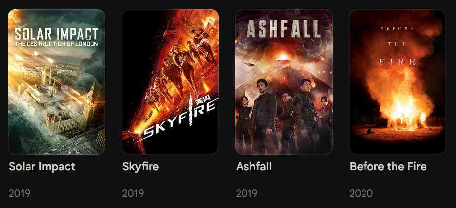
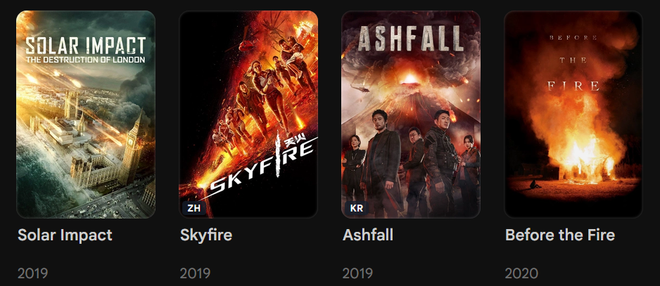

# Foreign language badge

Dark ISO-code pill (bottom-left) on **movie** and **episode** posters when the primary *defined* audio track is not English.

Tags like `und`, empty, unknown, and `mul` are ignored (no badge).

## Screenshots

| Before | After |
| --- | --- |
|  |  |

## Needs

- Jellyfin 10.11+ web
- [JavaScript Injector](https://github.com/IAmParadox27/jellyfin-plugin-javascript-injector)
- [Custom CSS](https://jellyfin.org/docs/general/clients/css-customization/)

## JS

1. Dashboard → Plugins → JavaScript Injector → new script.
2. Paste `foreign-language-badge.js`.
3. Enable, turn on **Requires Authentication**, save.

## CSS

1. Dashboard → Branding → Custom CSS (or `branding.xml` `<CustomCss>`).
2. Append `foreign-language-badge.css`.

Restart Jellyfin. Hard refresh (Ctrl+Shift+R).

## Behavior

| Case | Result |
| --- | --- |
| Primary audio `jpn` / `spa` / `fra` / etc. | Badge (`JP`, `ES`, `FR`, …) |
| Primary audio English (`eng` / `en`) | No badge |
| Language `und` / empty / unknown | No badge (skipped; next defined track may win) |
| Series / season cards | Skipped |

Primary track: `IsDefault` audio first, then stream order. Only defined languages count.

## Tuning

| Name | File |
| --- | --- |
| `PREFERRED`, `IGNORE`, `TO_BADGE` | `.js` |
| Badge color / position | `.css` |

`PREFERRED` defaults to English (`eng` / `en`). Add other codes if those are your native languages.

Default look is a dark translucent pill, bottom-left. Edit `background-color` / `left` / `bottom` in `foreign-language-badge.css` for your theme.
