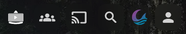
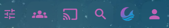

# Header buttons

CSS for Jellyfin web header icons (SyncPlay, cast, search, Moonfin, Media Bar Settings). Needs Abyss `--abyss-accent` or your own RGB triple.

## What it does

1. **Accent-tints** stock header Material icons (otherwise they stay muted gray).
2. **Moonfin** (`.headerMoonfinButton`): undoes the plugin's `opacity: .6` and soft accent glow on the icon image.
3. **Media Bar Settings**: MBE injects `logo_SW_MINIMAL.svg` on a button that also uses SyncPlay's `headerSyncButton` classes, which looks like two stacked icons. This hides the SVG and shows a single Material icon (`tune`).

## Screenshots

| Before | After |
| --- | --- |
|  |  |

## Install

Append `header-buttons.css` to Custom CSS (after your palette / Abyss imports).

Restart Jellyfin if branding is served from disk, then hard refresh (Ctrl+Shift+R).

## Tuning

| Want | Change |
| --- | --- |
| Different MBE icon | `content: "view_carousel"` / `"slideshow"` / `"movie_filter"` on `.media-bar-settings-button::before` |
| Stronger accent | Raise opacity on `.material-icons` from `0.88` toward `1` |
| Hide Moonfin header chip | `.headerMoonfinButton { display: none !important; }` |
