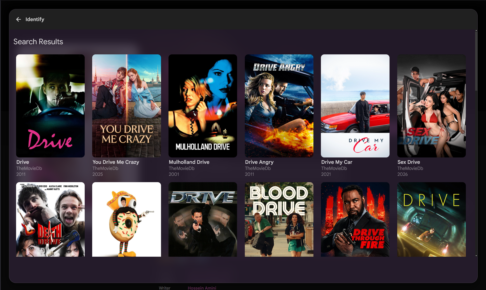
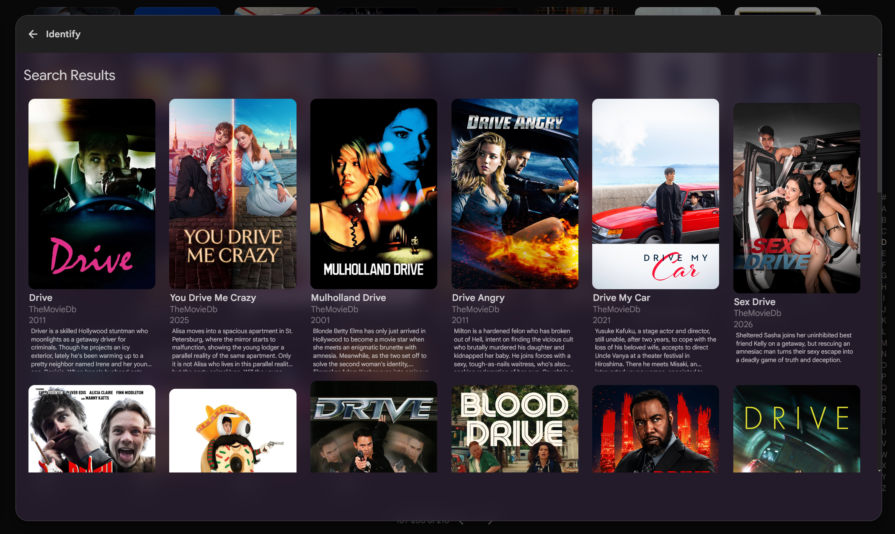
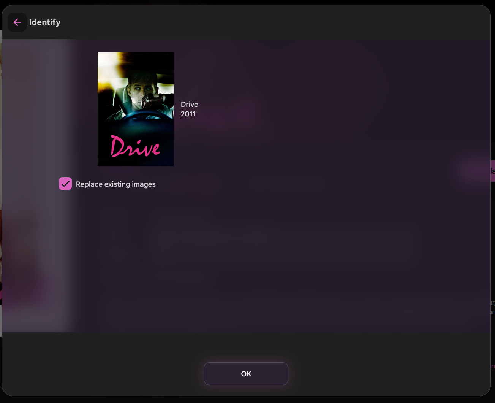
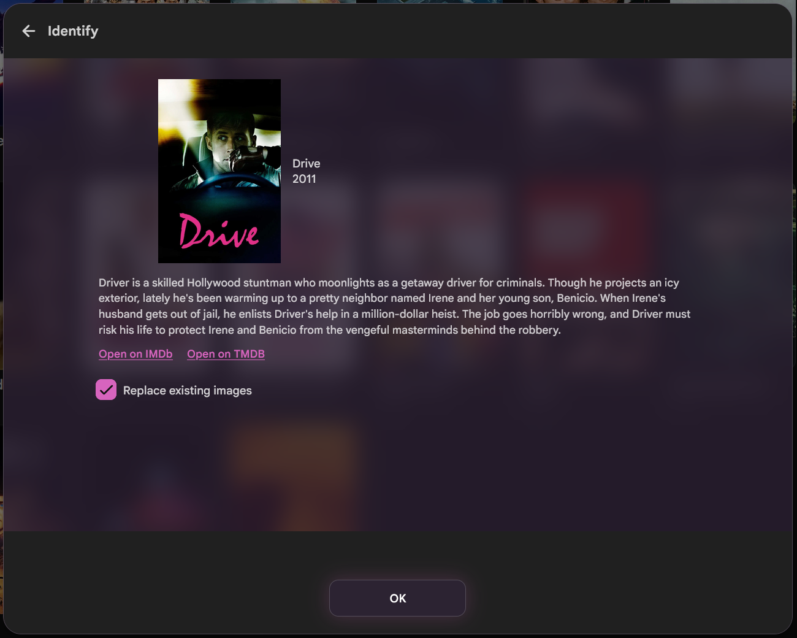

# Identify overview

Adds text to Jellyfin's Identify dialog:

1. **Search results:** overview under each match card
2. **Confirm screen** (after you pick one): full overview plus Open on IMDb / Open on TMDB when those IDs exist

Stock UI only shows name / provider / year on cards, and poster + name/year on confirm.

## Screenshots

### Search results

| Before | After |
| --- | --- |
|  |  |

### Confirm screen

| Before | After |
| --- | --- |
|  |  |

## Needs

- Jellyfin 10.11+ web
- [JavaScript Injector](https://github.com/IAmParadox27/jellyfin-plugin-javascript-injector)
- [Custom CSS](https://jellyfin.org/docs/general/clients/css-customization/)

## JS

1. Dashboard → Plugins → JavaScript Injector → new script.
2. Paste `identify-overview.js`.
3. Enable, turn on **Requires Authentication**, save.

## CSS

1. Dashboard → Branding → Custom CSS (or `branding.xml` `<CustomCss>`).
2. Append `identify-overview.css`.

Restart Jellyfin. Hard refresh (Ctrl+Shift+R).

## Notes

- Uses the existing `Items/RemoteSearch/*` response (no extra API calls).
- IMDb / TMDB links only appear when those provider IDs are on the selected result.
- Cards or confirms with no overview are left alone.
- Confirm links use `window.open` in the capture phase so the Identify form does not swallow clicks.
