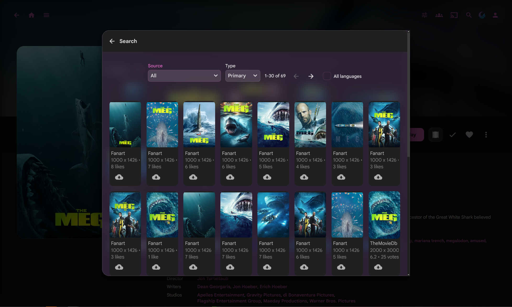
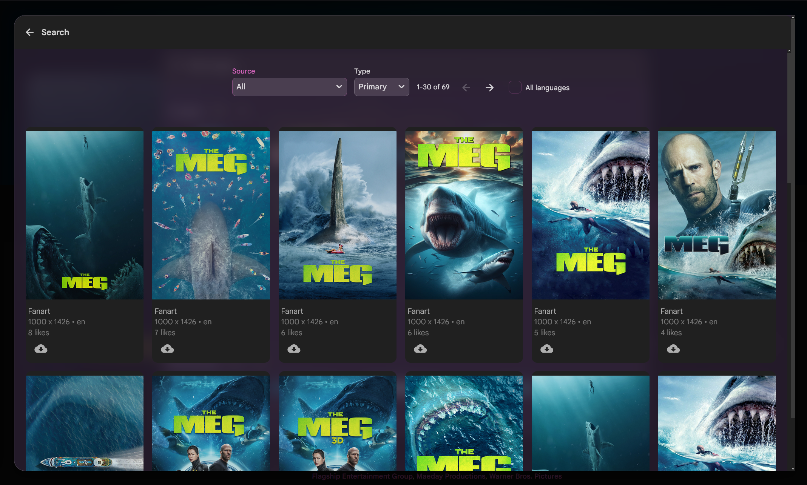

# Image search / Identify art dialog

Larger art pickers (96vw x 94vh). CSS only. Needs `:has()`.

## Covers

| Surface | Behavior |
| --- | --- |
| Edit images → Search | Always wide |
| Identify → Search results | Wide after you search |
| Identify form (name / year / IMDb / etc.) | Stays stock size |

Stock Jellyfin opens these as `size: "small"`.

## Screenshots

| Before | After |
| --- | --- |
|  |  |

## Needs

- Jellyfin 10.11+ web
- [Custom CSS](https://jellyfin.org/docs/general/clients/css-customization/)
- Browser with CSS `:has()`

## Install

1. Dashboard → Branding → Custom CSS (or `branding.xml` `<CustomCss>`).
2. Append `image-search-dialog.css`.
3. Restart Jellyfin. Hard refresh (Ctrl+Shift+R).

Also bundled in Abyss one-file themes such as `abyss/themes/rose-full.css`.

## Tuning

| What | Where |
| --- | --- |
| Dialog size | `96vw` / `94vh` in `.css` |
| Card widths | `.portraitCard` / `.backdropCard` / `.squareCard` rules |
