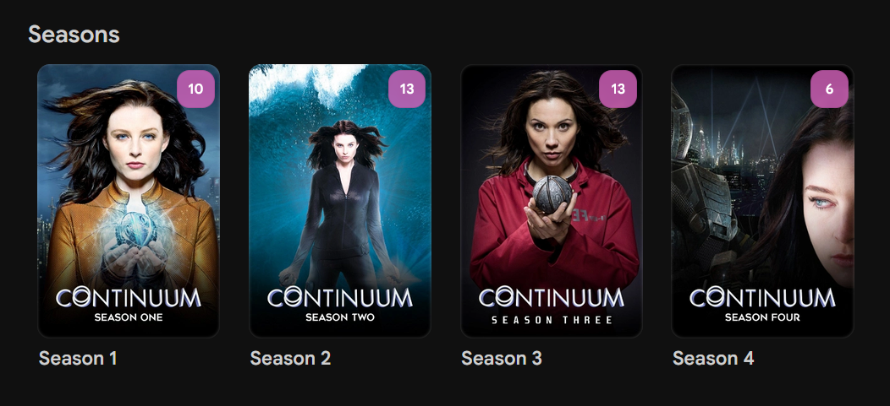
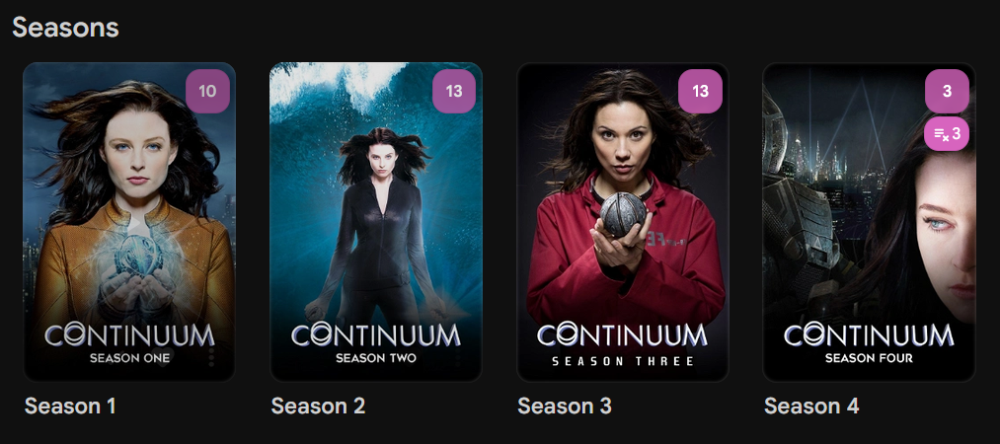

# Missing episode badge

Pink `playlist_remove` icon plus count on TV **series** and **season** posters (under the unwatched badge). Uses Jellyfin metadata only. Override the CSS color to match your theme.

Inspired by [this Reddit thread](https://www.reddit.com/r/JellyfinCommunity/comments/1t1zxb5/).

## Screenshots

| Before | After |
| --- | --- |
|  |  |

## Needs

- Jellyfin 10.11+ web
- [JavaScript Injector](https://github.com/IAmParadox27/jellyfin-plugin-javascript-injector)
- [Custom CSS](https://jellyfin.org/docs/general/clients/css-customization/)
- TV library: show missing episodes; providers fetch missing episodes; library scanned

## JS

1. Dashboard → Plugins → JavaScript Injector → new script.
2. Paste `missing-episode-badge.js`.
3. Enable, turn on **Requires Authentication**, save.

## CSS

1. Dashboard → Branding → Custom CSS (or `branding.xml` `<CustomCss>`).
2. Append `missing-episode-badge.css`.

Restart Jellyfin. Hard refresh (Ctrl+Shift+R).

## Tuning

| Name | File |
| --- | --- |
| `MISSING_ICON`, `IGNORE_SPECIALS`, `API_TOKEN` | `.js` |
| Badge color | `.css` |

### Badge color

Default:

`background-color: var(--jf-palette-primary-main, rgb(215, 100, 190));`

The `rgb(...)` value is a fallback only.

- Stock Jellyfin: use `var(--jf-palette-primary-main)` alone so it matches unwatched.
- Custom theme: set `--jf-palette-primary-main`, or edit the fallback in `missing-episode-badge.css`.

Does not run on the series hero poster. A season checkmark with only virtual episodes is Jellyfin watch state, not this script.

Movie/Collection cards are skipped so the observer does not keep rescanning them (v5).
